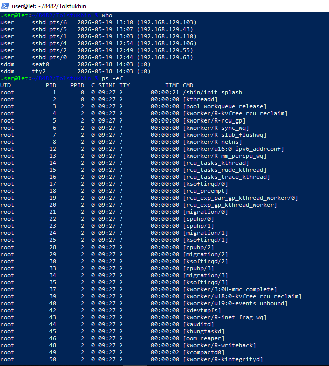
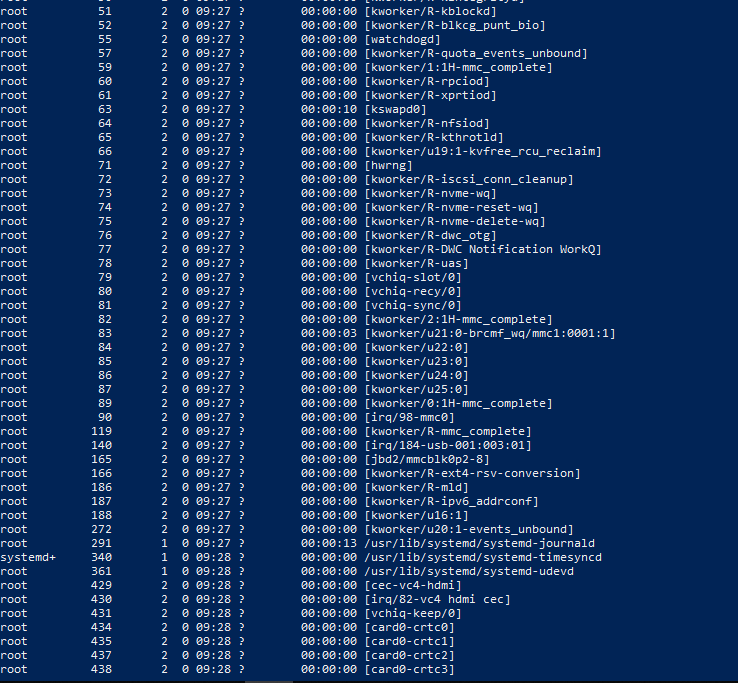

# Лабораторная работа № 24
## ИЗУЧЕНИЕ ФАЙЛОВОЙ СИСТЕМЫ ОС LINUX И ФУНКЦИЙ ПО ОБРАБОТКЕ И УПРАВЛЕНИЮ ДАННЫМИ

### Цель работы:
1. Изучение команд, связанных с пользователями и группами
2. Изучение структуры файловой системы Linux
3. Изучение команд создания, удаления, модификации файлов и каталогов
4. Приобретение навыков по смене атрибутов объектов и прав доступа
5. Изучение иерархии процессов и организации безопасности системы

### Ход выполнения работы:

**1. Подключение к серверу Linux**

Вы подключились к удалённому серверу Linux по SSH:


**2. Создание файлов и каталогов**

- Создали рабочую директорию `Tolstukhin` и перешли в неё
- Создали два текстовых файла: `file1.txt` и `file2.txt` с помощью команды `touch`
- Просмотрели содержимое директории командой `ls`

**3. Объединение файлов**

- Объединили два файла в один с помощью команды:
  ```bash
  cat file1.txt file2.txt > combined.txt
  ```

**4. Работа с директориями**

- Создали новую директорию `new`
- Переместили файлы `combined.txt`, `file1.txt` и `file2.txt` в директорию `new` с помощью команды `mv`

**5. Изменение прав доступа**

- Добавили право выполнения для группы и остальных пользователей:
  ```bash
  chmod go+x *
  ```
- Просмотрели атрибуты файлов командой `ls -la`

**6. Просмотр информации о процессах и пользователях**




- Получили список активных пользователей командой `who`
- Получили информацию о запущенных процессах командой `ps -ef`

### Изученные команды:

- **touch** - создание файлов
- **cat** - просмотр и объединение файлов
- **mkdir** - создание директорий
- **mv** - перемещение файлов
- **chmod** - изменение прав доступа
- **ls -la** - подробный список файлов с атрибутами
- **who** - список пользователей в системе
- **ps -ef** - информация о процессах

### Контрольные вопросы

## 1. Что считается файлами в ОС Linux?

В операционной системе **Linux** понятием «файл» охватывается широкий спектр объектов:

| Тип файла | Описание | Пример |
|-----------|----------|--------|
| 📄 Обычные файлы | Текстовые документы, исполняемые программы, скрипты | `document.txt`, `script.sh` |
| 📁 Каталоги | Специальные файлы, содержащие список других файлов | `/home`, `/etc` |
| 🔌 Специальные файлы устройств | Файлы, представляющие периферийные устройства | `/dev/sda`, `/dev/tty` |
| 🔗 Символические ссылки | Указатели на другие файлы или каталоги | `ln -s target link` |
| ⚙️ Блок-ориентированные файлы | Устройства с поблочным доступом (диски) | `/dev/sda1` |
| ⚡ Байт-ориентированные файлы | Устройства с побайтным доступом (терминалы, принтеры) | `/dev/tty0`, `/dev/lp0` |

> 💡 **Ключевая особенность:** Все объекты в Linux представлены как файлы, что обеспечивает единый интерфейс ввода-вывода и независимость программ от типа устройства.

---

## 2. Назначение связей с файлами и способы их создания

### 🔗 Назначение связей:
- Позволяют одному файлу иметь **несколько имён** и находиться в **разных каталогах**
- Экономят дисковое пространство (не создаётся копия данных)
- Упрощают организацию доступа к файлам

### 🛠️ Способы создания:

#### Жёсткая связь (hard link)
```bash
ln <исходный_файл> <имя_связи>
```
- Создаёт дополнительную запись в таблице inode
- Не может ссылаться на каталоги
- Файл удаляется только когда удалены все связи

#### Символическая связь (symbolic link)
```bash
ln -s <целевой_файл> <имя_ссылки>
```
- Создаёт специальный файл-указатель на путь к целевому файлу
- Может ссылаться на каталоги и несуществующие файлы
- При удалении целевого файла ссылка становится «битой»

### 📊 Сравнение:
| Характеристика | Жёсткая связь | Символическая связь |
|---------------|-------------|-------------------|
| Работает с каталогами | ❌ Нет | ✅ Да |
| Работает через ФС | ❌ Только в одной ФС | ✅ Может ссылаться на другие ФС |
| Занимает место | Минимально (запись в inode) | Небольшой файл с путём |
| При удалении оригинала | Файл остаётся доступным | Ссылка становится нерабочей |

---

## 3. Атрибуты файлов: просмотр и изменение

### 🔍 Что определяют атрибуты:
Атрибуты файла задают **права доступа** на трёх уровнях:
```
┌─────────────────────────────────┐
│  [тип] [владелец] [группа] [остальные]  │
│   -     rwx      r-x      r--    │
└─────────────────────────────────┘
```

| Уровень | Обозначение | Описание |
|---------|-------------|----------|
| 👤 Владелец | `u` (user) | Пользователь, создавший файл |
| 👥 Группа | `g` (group) | Пользователи одной группы с владельцем |
| 🌍 Остальные | `o` (others) | Все остальные пользователи системы |

### 🔑 Права доступа:
| Символ | Право | Описание |
|--------|-------|----------|
| `r` | Read | Чтение содержимого файла / просмотр каталога |
| `w` | Write | Запись в файл / создание файлов в каталоге |
| `x` | Execute | Выполнение файла / вход в каталог |
| `-` | Нет | Право отсутствует |

### 👁️ Просмотр атрибутов:
```bash
ls -l <файл>          # Подробный список с правами
ls -la                # Все файлы, включая скрытые
stat <файл>           # Детальная информация о файле
```
### ✏️ Изменение атрибутов (команда `chmod`):

#### Символьный режим:
```bash
chmod u+x script.sh        # Добавить выполнение владельцу
chmod g-w file.txt         # Убрать запись у группы
chmod o=r file.txt         # Установить только чтение для остальных
chmod a+rwx file.txt       # Полный доступ всем (a = all)
chmod go+rx directory/     # Чтение и выполнение для группы и остальных
```

#### Восьмеричный режим:
```
r=4, w=2, x=1  →  складываются для каждого уровня
```
```bash
chmod 755 script.sh   # rwx(7) r-x(5) r-x(5)
chmod 644 file.txt    # rw-(6) r--(4) r--(4)
chmod 700 private/    # rwx(7) ---(0) ---(0)
```

---

## 4. Методы создания и удаления файлов и каталогов

### 📄 Работа с файлами:

| Действие | Команда | Пример |
|----------|---------|--------|
| ✅ Создать пустой файл | `touch` | `touch newfile.txt` |
| ✅ Создать с содержимым | `>` / `echo` | `echo "text" > file.txt` |
| ✅ Просмотреть содержимое | `cat` | `cat file.txt` |
| ✅ Скопировать файл | `cp` | `cp source.txt backup.txt` |
| ✅ Переименовать/переместить | `mv` | `mv old.txt new.txt` |
| ✅ Удалить файл | `rm` | `rm file.txt` |
| ✅ Удалить с подтверждением | `rm -i` | `rm -i *.log` |
| ✅ Объединить файлы | `cat` | `cat f1.txt f2.txt > combined.txt` |

### 📁 Работа с каталогами:

| Действие | Команда | Пример |
|----------|---------|--------|
| ✅ Создать каталог | `mkdir` | `mkdir projects` |
| ✅ Создать вложенные | `mkdir -p` | `mkdir -p a/b/c` |
| ✅ Перейти в каталог | `cd` | `cd /home/user` |
| ✅ Показать текущий путь | `pwd` | `pwd` → `/home/user` |
| ✅ Удалить пустой каталог | `rmdir` | `rmdir empty_dir` |
| ✅ Удалить каталог с содержимым | `rm -r` | `rm -rf old_project/` |

> ⚠️ **Внимание:** Команда `rm -rf` удаляет файлы безвозвратно и без подтверждения — используйте с осторожностью!

---

## 5. Поиск по шаблону

### 🔍 Команда `grep` — поиск строк по шаблону:

```bash
grep [опции] "шаблон" <файл>
```

### 🎯 Основные опции:

| Опция | Описание | Пример |
|-------|----------|--------|
| `-i` | Игнорировать регистр | `grep -i "error" log.txt` |
| `-v` | Показать строки **без** шаблона | `grep -v "debug" app.log` |
| `-c` | Показать количество совпадений | `grep -c "FAIL" test.log` |
| `-n` | Показать номера строк | `grep -n "TODO" code.py` |
| `-l` | Показать только имена файлов | `grep -l "config" *.conf` |
| `-r` | Рекурсивный поиск по каталогам | `grep -r "password" /etc/` |
| `--color` | Подсветка совпадений | `grep --color "key" file.txt` |

### 🔄 Регулярные выражения:
`grep` поддерживает базовые регулярные выражения:
```bash
grep "^Error" log.txt      # Строки, начинающиеся с "Error"
grep "txt$" *.log          # Файлы, заканчивающиеся на "txt"
grep "[0-9]\{3\}" data.txt # Три цифры подряд
```

---

## 6. Список работающих пользователей

### 👥 Просмотр активных пользователей:

```bash
who          # Кто сейчас в системе
w            # Кто в системе и что делает
users        # Простой список имён пользователей
```

### 💾 Сохранение списка в файл:

```bash
# Сохранить вывод команды who в файл
who > active_users.txt

# Сохранить с датой и временем
echo "=== $(date) ===" > users_$(date +%Y%m%d).txt && who >> users_$(date +%Y%m%d).txt

# Сохранить расширенную информацию
w > system_users_report.txt
```

### 🔍 Фильтрация и анализ:

```bash
# Найти конкретного пользователя
who | grep "student"

# Посчитать количество пользователей
who | wc -l

# Вывести только имена пользователей
who | awk '{print $1}' | sort | uniq
```

### 📊 Пример вывода `who`:
```
student   tty1         2024-03-10 09:15 (:0)
admin     pts/0        2024-03-10 10:22 (192.168.1.100)
guest     pts/1        2024-03-10 11:05 (10.0.0.50)
```

| Поле | Значение |
|------|----------|
| `student` | Имя пользователя |
| `tty1` / `pts/0` | Терминал подключения |
| `2024-03-10 09:15` | Время входа |
| `(:0)` / `(IP)` | Источник подключения |

### Вывод:
В ходе лабораторной работы вы освоили базовые операции с файловой системой Linux: создание и управление файлами и директориями, изменение прав доступа, а также получили информацию о пользователях и процессах в системе.
