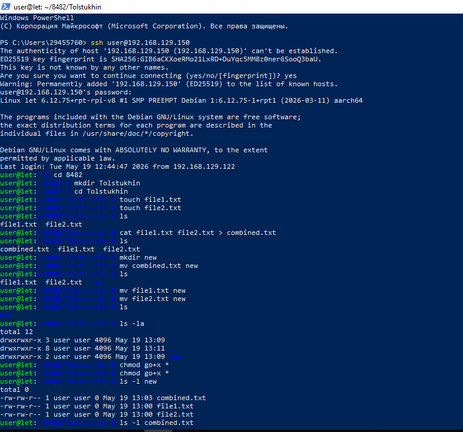

# Лабораторная работа № 2
## ИЗУЧЕНИЕ ФАЙЛОВОЙ СИСТЕМЫ ОС LINUX И ФУНКЦИЙ ПО ОБРАБОТКЕ И УПРАВЛЕНИЮ ДАННЫМИ

### Цель работы:
1. Изучение команд, связанных с пользователями и группами
2. Изучение структуры файловой системы Linux
3. Изучение команд создания, удаления, модификации файлов и каталогов
4. Приобретение навыков по смене атрибутов объектов и прав доступа
5. Изучение иерархии процессов и организации безопасности системы

### Ход выполнения работы:

**1. Подключение к серверу Linux**

Вы подключились к удалённому серверу Linux по SSH:



**2. Создание файлов и каталогов**

- Создали рабочую директорию `Tolstukhin` и перешли в неё
- Создали два текстовых файла: `file1.txt` и `file2.txt` с помощью команды `touch`
- Просмотрели содержимое директории командой `ls`

**3. Объединение файлов**

- Объединили два файла в один с помощью команды:
  ```bash
  cat file1.txt file2.txt > combined.txt
  ```

**4. Работа с директориями**

- Создали новую директорию `new`
- Переместили файлы `combined.txt`, `file1.txt` и `file2.txt` в директорию `new` с помощью команды `mv`

**5. Изменение прав доступа**

- Добавили право выполнения для группы и остальных пользователей:
  ```bash
  chmod go+x *
  ```
- Просмотрели атрибуты файлов командой `ls -la`

**6. Просмотр информации о процессах и пользователях**


- Получили список активных пользователей командой `who`
- Получили информацию о запущенных процессах командой `ps -ef`

### Изученные команды:

- **touch** - создание файлов
- **cat** - просмотр и объединение файлов
- **mkdir** - создание директорий
- **mv** - перемещение файлов
- **chmod** - изменение прав доступа
- **ls -la** - подробный список файлов с атрибутами
- **who** - список пользователей в системе
- **ps -ef** - информация о процессах

### Вывод:
В ходе лабораторной работы вы освоили базовые операции с файловой системой Linux: создание и управление файлами и директориями, изменение прав доступа, а также получили информацию о пользователях и процессах в системе.
